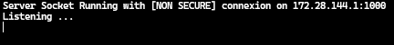
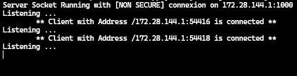

<h1>Chat Application - Java Sockets</h1>
<p>This project is a multi-client chat application built with Java, designed to explore socket programming. The application is developed in two steps:</p>
<ul>
<li>Non-Secure Communication: The initial version uses plain sockets for communication.</li>
<li>Secure Communication: The last version implements SSL for secure communication using Java's SSL API.</li>
</ul>
<div>
The application supports:
<ul>
<li>Client-Server Communication: Clients interact directly with the server.</li>
<li>Client-Client Communication: Clients can communicate with each other through the server as a bridge.</li>
<li>Group Communication: Messages sent by one client can be broadcast to a group via the server.</li>
</ul>
</div>

<h3>Project Structure</h3>

<h3>Database schema</h3>

````sql
CREATE TABLE users (
        login VARCHAR(50) PRIMARY KEY,
        isConnected BOOLEAN DEFAULT FALSE
);
````
<h3>Compile the Application</h3>
<pre>
javac -cp ".;lib/postgresql-42.6.0.jar" -d target/classes src/main/java/kad/dev/*.java
</pre>
<h3>Package Unsecure Application into a JAR</h3>
<pre>
jar cfm target/unsecure.jar src/main/resources/UNSECURE.TXT -C target/classes . ./lib/postgresql-42.6.0.jar
</pre>
<pre>
jar cfm target/secure.jar src/main/resources/SECURE.TXT -C target/classes . ./lib/postgresql-42.6.0.jar
</pre>
<h2>Run the Server using Unsecure Sockets</h2>
<pre>
java -cp "target/unsecure.jar;lib/postgresql-42.6.0.jar" main.java.kad.dev.Server
</pre>
<h5>After Running Server</h5>

<h5>Connect as Telnet Clients</h5>
<h3>Telnet command:</h3>
<pre>
telnet [server_socket_ip] [server_socket_port]
</pre>


<br>
------------------------------------------------------------------------
<h3>Generate SSL Certificate</h3>
<pre>
keytool -genkeypair -alias server -keyalg RSA -keystore server.jks -validity 365
</pre>
<h3>Package Secure Application into a JAR</h3>
<pre>
jar cfm target/secure.jar src/main/resources/SECURE.TXT -C target/classes . ./lib/postgresql-42.6.0.jar
</pre>
<h2>Run the Server using Secure Sockets (SSL/TLS)</h2>
<pre>
java -cp "target/secure.jar;lib/postgresql-42.6.0.jar" main.java.kad.dev.SecureServer
</pre>
<h5>After Running Server</h5>

<h5>Connect as OpenSSL Clients</h5>
<h3>OpenSSL command:</h3>
<pre>
openssl s_client -connect [server_socket_ip]:[server_socket_port]
</pre>

